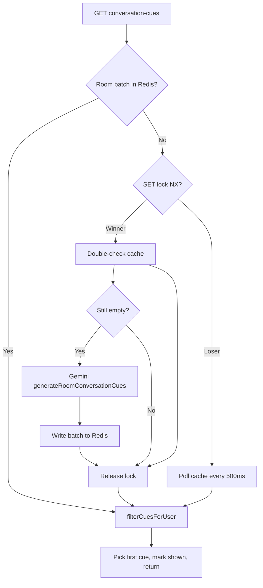

# Conversation cues — design & implementation

**Status:** Implemented  
**Last updated:** 2026-07-01  
**Related:** [session-activities-and-match-modes.md](./session-activities-and-match-modes.md), [matching-system-design.md](./matching-system-design.md), [room-activities-and-chess.md](./room-activities-and-chess.md)

Conversation cues are short, in-call toast hints that help two people in a **direct 1:1 call** start or continue conversation. Examples: “You both picked chess”, “They selected Vent”, “You’re both feeling Chill”. Cues are grounded in profile snapshots (interests, moods, session activities, etc.) and generated once per call via **Gemini Flash Lite**, then served from **Redis**.

This document explains the product behavior, architecture, performance model, and the **room-level cache + distributed lock** pattern used to avoid duplicate AI work.

---

## 1. Goals

| Goal | Description |
|------|-------------|
| **G1** | Reduce awkward silence in direct calls with timely, data-grounded hints |
| **G2** | Use existing profile snapshot data (no extra DB reads during the call when cache is warm) |
| **G3** | Stay lightweight on the client — no polling, no Redux, no re-renders |
| **G4** | Cap cost: at most **one Gemini call per direct room**, at most **two cues per user per call** |
| **G5** | Safe under concurrency — simultaneous joins must not trigger duplicate generation |

---

## 2. Terminology

| Term | Meaning |
|------|---------|
| **Conversation cue** | A single hint (`title`, optional `body`, optional `emoji`) shown as a Sonner toast |
| **Cue batch** | Full ordered list of cues generated for a room (cached in Redis) |
| **Shown set** | Cue IDs already delivered to a specific user in this room |
| **Session activity** | What the user wants to do on this call (chess, vent, language practice, …) — see [session-activities-and-match-modes.md](./session-activities-and-match-modes.md) |
| **Profile snapshot** | Redis JSON at `user:profile:snapshot:{userId}` — same source matching uses |
| **Symmetric cue** | Applies equally to both participants (e.g. shared interest) |
| **Peer-only cue** | Applies to one viewer only (e.g. “They selected Vent”) |

> **Not the same as:** in-room chess / `roomActivity` Redux state ([room-activities-and-chess.md](./room-activities-and-chess.md)). Conversation cues are read-only hints, not interactive activities.

---

## 3. Product behavior

### 3.1 When cues run

| Condition | Cues enabled? |
|-----------|---------------|
| Direct 1:1 call | Yes |
| Group / space call | No |
| User still in RTC lobby wait | No |
| mediasoup not ready | No |
| Either user blocked the other | No (empty response) |
| Room not live / not participant | HTTP error from guardrails |

Client hook is mounted from `in-call-container.tsx`:

```ts
useRoomConversationCues({
  roomId,
  enabled: !isGroupRoom && Boolean(peerId) && mediasoupReady && !rtcLobbyWait,
});
```

### 3.2 Client timing (drip, not poll)

| Event | Delay |
|-------|-------|
| First fetch after join | **2.5 s** (`INITIAL_DELAY_MS`) |
| Second fetch (only if `hasMore`) | **150 s** (`DRIP_DELAY_MS`) after first |

- At most **2 HTTP GETs** per call per client.
- Errors are swallowed — no retry loop.
- Hook uses `useRef` + `useEffect` only — **no React state**, so zero re-renders from cues.

### 3.3 Per-user limits

- Each participant may receive at most **2 cues** per call (`CONVERSATION_CUES_MAX_PER_CALL`).
- “Already shown” is tracked **per user** even though the batch is **per room**.
- Both users may see the same symmetric cue (e.g. “You both like chess”) — each tracks it in their own shown set.

### 3.4 UX

- Toast duration: **8 seconds**
- Stable toast id: `conversation-cue-{roomId}-{cueId}` (dedupes duplicate renders)
- Title prefixed with emoji when present

---

## 4. API

### 4.1 Endpoint

```
GET /api/room/:roomId/conversation-cues
```

**Auth:** session cookie (same as other room routes)

**Response (200):**

```json
{
  "success": true,
  "data": {
    "cue": {
      "id": "shared_play_chess",
      "title": "You both selected Play chess",
      "body": "Easy icebreaker once you've said hi.",
      "emoji": "♟️"
    },
    "hasMore": true
  }
}
```

When no cue is available:

```json
{
  "success": true,
  "data": { "cue": null, "hasMore": false }
}
```

**Note:** The API returns a trimmed DTO to the client (`id`, `title`, `body`, `emoji`). Internal fields `kind` and `priority` are used server-side for filtering and ordering.

### 4.2 Error cases (guardrails)

Uses `ensureDirectRoomActivityContext` — same pattern as other direct-room activities:

| Code | When |
|------|------|
| `ROOM_NOT_FOUND` | 404 |
| `ROOM_NOT_LIVE` | 400 |
| `NOT_DIRECT` | 400 |
| `NOT_PARTICIPANT` | 403 |
| `PEER_NOT_FOUND` | 400 |

---

## 5. Architecture overview

```text
┌─────────────────┐     GET (max 2×)      ┌──────────────────────────────┐
│  Client hook    │ ────────────────────► │  conversation-cues.controller  │
│  useRoom...     │                       │  getNextConversationCueService │
└─────────────────┘                       └──────────────┬───────────────┘
                                                         │
                    ┌────────────────────────────────────┼────────────────────────┐
                    │                                    ▼                        │
                    │  1. Guardrails (room, participant, block)                   │
                    │  2. Load profile snapshots (Redis)                          │
                    │  3. resolveCueCandidates                                    │
                    │       ├─ read room batch cache                              │
                    │       ├─ if miss: lock → Gemini → write cache               │
                    │       └─ filterCuesForUser (per-user + shown set)         │
                    │  4. markCueShown (per user)                                  │
                    │  5. return { cue, hasMore }                                 │
                    └─────────────────────────────────────────────────────────────┘
                                         │
                    ┌────────────────────┼────────────────────┐
                    ▼                    ▼                    ▼
              Redis (batch,         Gemini Flash Lite    Postgres (guardrails,
              shown, lock)          (once per room)       blocks — only on request)
```

### 5.1 Design pattern: generate once, personalize at read time

**Problem:** A single AI batch is shared by both participants, but some cues are viewer-specific (“They selected Vent”).

**Solution:**

1. Generate cues for **PARTICIPANT_A** and **PARTICIPANT_B** (canonical order by user id).
2. Encode asymmetric cues in the cue `id`: `peer_session:a:vent` or `peer_session:b:chess`.
3. When serving, **filter** the batch per user — peer-only cues go only to the participant who did *not* select the activity.

This halves Gemini cost vs per-user generation without sacrificing correct UX.

---

## 6. Redis data model

All keys use `ROOM_TTL` (**7200 s / 2 hours**), aligned with other room-scoped cache.

| Key | Scope | Type | Purpose |
|-----|-------|------|---------|
| `room:conversation-cues:batch:{roomId}` | Per **room** | String (JSON array) | Full cue batch from Gemini |
| `room:conversation-cues:shown:{roomId}:{userId}` | Per **user** | Set of cue ids | Cues already toasted to this user |
| `room:conversation-cues:generating:{roomId}` | Per **room** | String (`"1"`) | Short-lived generation lock |

### 6.1 Why split batch vs shown?

| Store | Shared? | Reason |
|-------|---------|--------|
| Batch | Yes (per room) | One Gemini call serves both participants |
| Shown | No (per user) | Each person has their own drip schedule and may see different peer-only cues first |

Empty batches are **not** written to Redis (failed generation can be retried on next request).

---

## 7. Generation flow (cache + lock)



### 7.1 Distributed lock details

| Constant | Value | Purpose |
|----------|-------|---------|
| `GENERATION_LOCK_TTL_SEC` | 45 | Auto-expire if server crashes mid-generation |
| `GENERATION_WAIT_MS` | 500 | Loser poll interval |
| `GENERATION_MAX_WAIT_ATTEMPTS` | 60 | ~30 s max wait before giving up |

**Mechanism:** `SET key "1" EX 45 NX` — atomic “set only if not exists”.

**Winner path:**

1. Acquire lock
2. **Double-check** cache (another request may have finished between first read and lock)
3. Call Gemini if still empty
4. Write batch
5. `DEL` lock in `finally` (always runs)

**Loser path:**

1. Poll cache every 500 ms
2. Return when batch appears, or lock is gone, or timeout

This is standard **double-checked locking** for distributed caches.

---

## 8. Cue types & ID conventions

| `kind` | Meaning | Visible to |
|--------|---------|------------|
| `shared_session_activity` | Both picked same session activity | Both |
| `shared_session_activity_detail` | Same activity + same detail | Both |
| `peer_session_activity` | Only one participant picked it | **Other** participant only |
| `shared_interest` | Overlapping profile interests | Both |
| `shared_mood` | Same mood | Both |
| `shared_looking_for` | Same looking-for style | Both |
| `shared_goal` | Same goal | Both |
| `ai_generated` | Other safe, data-grounded opener | Both (default) |

### 8.1 Peer-only ID format

```
peer_session:a:<activity_slug>   → only PARTICIPANT_A selected it
peer_session:b:<activity_slug>   → only PARTICIPANT_B selected it
```

**PARTICIPANT_A / B** are determined by lexicographic user id order:

```ts
userId < peerUserId
  ? { participantA: userId, participantB: peerUserId }
  : { participantA: peerUserId, participantB: userId };
```

### 8.2 Filtering logic

```ts
// Symmetric cues → always visible
// peer_session_activity → visible only when userId !== selector
filterCuesForUser(batch, userId, participants, shownSet)
```

Peer-only cues use titles like “They selected Vent” — shown only to the person who did **not** pick Vent.

---

## 9. Gemini integration

| Setting | Value |
|---------|-------|
| Model | `gemini-flash-lite-latest` |
| Output | JSON (`responseMimeType: application/json`) |
| Temperature | 0.7 |
| Max cues requested | 8 (server returns top after priority sort) |
| Shown to user per call | ≤ 2 |

**Input:** Two `ProfileSnapshotContext` objects parsed from Redis profile snapshots (display name, bio, interests, moods, session activities, etc.).

**Prompt rules (high level):**

- Only use facts present in profile data — never invent hobbies or cities
- Stable slug ids; peer-only ids must use `peer_session:a|b:` prefix
- Title ≤ 12 words; body ≤ 20 words or null
- Priority 0–100; higher = shown first

**Failure:** Gemini errors log a warning and return `[]` — client gets `{ cue: null, hasMore: false }` with no retry storm.

---

## 10. Performance & cost model

### 10.1 Client

| Metric | Value |
|--------|-------|
| HTTP requests per call | ≤ 2 |
| Polling | None |
| React re-renders from hook | 0 |
| Competes with join/RTC? | No — first fetch delayed 2.5 s |

### 10.2 Server (per direct call)

| Metric | Before optimization | After optimization |
|--------|---------------------|-------------------|
| Gemini calls | Up to 2 (per user) + race duplicates | **1** (per room) |
| Redis reads (warm) | Low | Low |
| DB queries per cue fetch | ~4 (guardrails + block) | ~4 (unchanged; max 2 fetches/user) |

### 10.3 What we optimized (2026-07-01)

1. **Room-level batch cache** — key changed from `batch:{roomId}:{userId}` to `batch:{roomId}`.
2. **Redis generation lock** — prevents duplicate Gemini when both users request at the same time.
3. **Per-user filtering** — `filter-room-cues.util.ts` personalizes shared batch at serve time.

---

## 11. File map

### Client

| File | Role |
|------|------|
| `client/src/features/room/conversation-cues/hooks/use-room-conversation-cues.ts` | Drip fetch + toast |
| `client/src/features/room/call/shell/in-call-container.tsx` | Enables hook in direct calls |
| `client/src/lib/api/endpoints.ts` | `ROOM.conversationCues(roomId)` |

### Server

| File | Role |
|------|------|
| `server/src/modules/rooms/router.ts` | Route registration |
| `server/src/modules/rooms/controllers/conversation-cues.controller.ts` | HTTP handler |
| `server/src/modules/rooms/services/conversation-cues/conversation-cues.service.ts` | Cache, lock, orchestration |
| `server/src/modules/rooms/services/conversation-cues/generate-conversation-cues-gemini.service.ts` | Prompt + Gemini call |
| `server/src/modules/rooms/services/conversation-cues/filter-room-cues.util.ts` | Canonical participants + per-user filter |
| `server/src/modules/rooms/services/conversation-cues/parse-profile-snapshot.util.ts` | Snapshot → prompt context |
| `server/src/modules/rooms/services/conversation-cues/parse-gemini-cues.util.ts` | JSON response validation |
| `server/src/modules/rooms/services/conversation-cues/conversation-cues.types.ts` | DTOs |

### Tests

| File | Covers |
|------|--------|
| `filter-room-cues.util.test.ts` | Canonical order, peer-only visibility, shown filtering |
| `parse-gemini-cues.util.test.ts` | JSON parse, dedupe, fence stripping |

---

## 12. Edge cases

| Scenario | Behavior |
|----------|----------|
| Both users join simultaneously | Lock ensures one Gemini call; other waits for cache |
| Gemini returns empty | No batch written; next request may retry |
| Profile snapshot missing | Empty response (no Gemini) |
| User already saw 2 cues | `{ cue: null, hasMore: false }` |
| First cue in batch is peer-only for other user | Filter skips it; user gets next applicable cue |
| User leaves call before drip | `useEffect` cleanup cancels timers and in-flight handling |
| Lock holder crashes | Lock expires after 45 s; waiter or next request can generate |
| Same symmetric cue | Both users may see it; each tracks in own shown set |

---

## 13. Manual test checklist

- [ ] Direct call: first toast ~2.5 s after media ready
- [ ] Second toast ~150 s later when overlaps exist (`hasMore: true`)
- [ ] Group/space call: no cue requests in network tab
- [ ] Blocked peer: no cues
- [ ] Shared activity overlap: both users can see “You both selected …”
- [ ] One-sided session activity: only the *other* user sees “They selected …”
- [ ] Redis: one `batch:{roomId}` key per call; two `shown:{roomId}:{userId}` sets
- [ ] Concurrent join: server logs at most one `[generateRoomConversationCuesWithGemini] generated` per room

---

## 14. Future improvements (not implemented)

| Idea | Benefit |
|------|---------|
| Integration test with mocked Redis for lock contention | Regression safety for race path |
| Pre-warm batch during match accept (before RTC ready) | Earlier first toast |
| Rate limit per user on endpoint | Abuse hardening |
| Server-side move validation for cues that reference chess | Only if cues ever trigger actions |

---

## 15. Mental model

Think of a **single kitchen order per table**:

- **Batch cache** = the finished platter on the pass
- **Lock** = “order in progress” sign so two waiters don’t both fire the kitchen
- **Filter** = plating per diner (shared dishes for everyone; allergy-specific items only where appropriate)
- **Shown set** = each diner’s “already served” tick sheet

One cook (Gemini), one order (room), personalized service (per-user filter + shown tracking).
