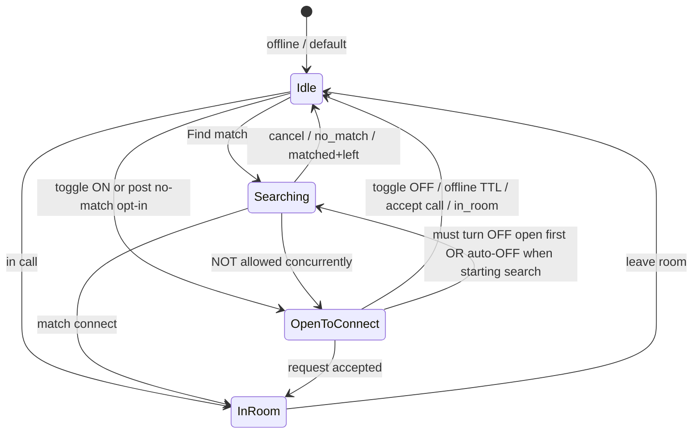

# Open to Connect — design spec

**Status:** Draft for phased implementation  
**Last updated:** 2026-06-28  
**Related:** [session-activities-and-match-modes.md](./session-activities-and-match-modes.md), [matching-system-design.md](./matching-system-design.md), [matching-engine.md](../matching/matching-engine.md)

This document defines **Open to Connect** — a passive discoverability mode where users visible on Home, Explore, and the dashboard sidebar can receive **connect requests** from others. It explicitly separates this from the **active matching search pool** (`searching`) and defines a **searcher fallback** that surfaces open users via **request**, never auto-pair.

---

## 1. Goals

| Goal | Description |
|------|-------------|
| **G1** | User can turn on “Let people find me” with session context (activities, interests, moods) |
| **G2** | Other users discover them on Home, Explore, and Home right sidebar |
| **G3** | Remote user sends a **connect request**; host accepts or rejects |
| **G4** | On accept → 1:1 direct room/call (same outcome as a successful match connect) |
| **G5** | After failed 1:1 match search → offer auto **Open to Connect** (opt-in) |
| **G6** | Active searchers may see open users as **last-resort suggestions** — **request only**, no auto-pair |
| **G7** | Do not break existing matching orchestrator, connection graph, or presence |

---

## 2. Terminology

| Term | User-facing | Code | Meaning |
|------|-------------|------|---------|
| **Open to Connect** | “Let people find me” / “Open now” | `openToConnect: true` | Passively discoverable; **not** searching |
| **Searching** | “Finding a match…” | `userState: searching` | Active matchmaking queue (existing) |
| **Connect request** | “Request to connect” | `connect_request` | Inbound ask to start 1:1; accept/reject |
| **Connection request** | “Connect” on profile | `user_connections` | Permanent network link (existing — **different**) |
| **Session activity** | Chip on card | from [session-activities doc](./session-activities-and-match-modes.md) | What they want to do |
| **Passive candidate** | *(internal)* | open-user in fallback list | Open user shown to searcher; not in search pool |

> **Rule:** Never call Open to Connect “searching” or “in the matching pool”. It is a **discovery index** + **request inbox**.

---

## 3. Product summary

### 3.1 Two ways to become discoverable

| Path | Trigger | User action |
|------|---------|-------------|
| **Manual** | Dashboard / match prep toggle | User turns on “Let people find me” + picks what to show (activities, etc.) |
| **Post no-match** | 1:1 search returns `no_match` | Client shows: “No one matched — stay open so people can find you?” → opt-in |

Both set the same backend flag. Post no-match **never** auto-enables without confirmation.

### 3.2 Discovery surfaces (read)

| Surface | Section | Content |
|---------|---------|---------|
| **Home** | New section below hero or in main column | “Open now” — cards filtered by relevance |
| **Explore** | New section or filter chip | Browse open users by activity / interest |
| **Home right sidebar** | Extend or replace part of `DashboardActiveNowSection` pattern | Compact list: avatar, name, primary activity, “Request” |
| **Active searcher (fallback UI)** | Inline during search (phase D) | “These people are open — send a request” (not auto-match) |

### 3.3 Connect request flow (write)

```
Viewer (A)                          Open user (B)
    |                                      |
    |-- POST connect-request ------------->|
    |                                      |-- notification / socket
    |                                      |-- Accept / Reject
    |<-- accepted: roomId + join ----------|  (or declined)
    |                                      |
    Both join 1:1 direct room (match category)
```

- **Not** the same as `user_connections` request (network). Naming in UI: **“Request to talk”** or **“Connect now”** to avoid confusion.
- On **accept**: create direct room (reuse match-room / connection-call provisioning patterns), both users notified.
- On **reject**: request terminal; A may be rate-limited from re-requesting B for a cooldown.

---

## 4. State machine (per user)

A user is in **exactly one** of these visibility/match states at a time:



### 4.1 Mutual exclusion (critical)

| State A | State B | Allowed? |
|---------|---------|----------|
| `searching` | `open_to_connect` | **No** — starting search clears open; enabling open cancels search |
| `in_room` | `open_to_connect` | **No** — hidden from feed, flag cleared or suspended |
| `open_to_connect` | pending inbound request | **Yes** |
| `searching` | viewing open-user fallback list | **Yes** — searcher still searching; open users not in pool |

---

## 5. Matching pool — explicit rules

### 5.1 Open users do NOT join the searching pool

| Pool / key (existing) | Open user included? |
|-----------------------|---------------------|
| `mm:pool:*` / searching zsets | **No** |
| `userState === searching` | **No** |
| `tryPairWithSortedCandidates` eligibility | **No** — peer must be `searching` today |

**Why:** Orchestrator pairs two **searching** users ([orchestrator.ts](../../matching-service/src/modules/simple-matching/orchestrator.ts)). Injecting passive users causes surprise matches and state bugs.

### 5.2 Searcher last fallback — open users as passive candidates (Phase D)

After normal retries + `tryFallbackMatch` still fail (or in parallel near timeout), searcher client or server suggests **open-to-connect** users:

| Aspect | Behavior |
|--------|----------|
| **Trigger** | `no_match` imminent OR ~20s before search timeout OR immediately after `no_match` |
| **Source** | Separate Redis index `otc:index:*` (not matching pool) |
| **Filter** | Blocks, guest policy, activity/interest overlap with searcher snapshot |
| **Action** | Searcher taps **Send request** → normal connect-request flow |
| **Auto-pair** | **Forbidden** — never call `tryPairWithSortedCandidates` with open user |
| **Searcher state** | Remains `searching` until cancel/no_match; optional cancel when sending request |

This is **discovery-assisted matching**, not pool membership.

### 5.3 Post no-match → Open to Connect offer

When engine returns `no_match` ([handleMatchFailed](../../server/src/modules/rooms/controllers/room.controller.ts)):

1. Client receives `match:no_match`.
2. Show modal: “No one available right now. Let people find you?”
3. Prefill card from last match prep (activities, moods, interests).
4. User confirms → `POST /open-to-connect/enable` (not searching).
5. User declines → idle.

---

## 6. Data model

### 6.1 Postgres

Extend `current_status` (same row as match prep):

```sql
open_to_connect boolean NOT NULL DEFAULT false,
open_to_connect_updated_at timestamp,
open_to_connect_source varchar(32),  -- 'manual' | 'post_no_match'
-- Reuse current_status_moods, current_status_looking_for, current_status_activities
-- Optional: open_to_connect_headline varchar(120) — short public line
```

**Connect requests** (new table):

```sql
connect_requests (
  id uuid PK,
  requester_user_id uuid NOT NULL REFERENCES users(id),
  target_user_id uuid NOT NULL REFERENCES users(id),
  status connect_request_status NOT NULL,  -- pending | accepted | rejected | expired | cancelled
  message varchar(280) NULL,             -- optional intro
  match_score_snapshot int NULL,           -- optional, for analytics
  room_id uuid NULL REFERENCES rooms(id),  -- set on accept
  created_at timestamp NOT NULL,
  responded_at timestamp NULL,
  expires_at timestamp NOT NULL,
  UNIQUE (requester_user_id, target_user_id) WHERE status = 'pending'  -- partial unique
)
```

Index: `(target_user_id, status)`, `(requester_user_id, created_at)`.

### 6.2 Redis (discovery index)

Separate from matching keys:

| Key | Type | Purpose |
|-----|------|---------|
| `otc:online` | SET | userIds currently open + online |
| `otc:user:{userId}` | HASH | `profileId`, `updatedAt`, serialized tags JSON |
| `otc:activity:{activityId}` | SET | userIds open with that activity |
| `otc:interest:{interestId}` | SET | userIds open (optional v1.1) |
| `otc:pending:{targetUserId}` | STRING | requestId of single pending inbound (NX) |

**TTL:** Refresh `otc:user:{userId}` on heartbeat (socket presence, same as online set). On disconnect → remove from all sets.

**Sync:** On enable/disable open-to-connect, update PG + Redis in one logical operation; on failure, prefer **not visible** (remove from Redis) over stale visibility.

### 6.3 Profile snapshot extension

Add to `user:profile:snapshot:{userId}`:

```json
{
  "currentStatus": {
    "openToConnect": false,
    "activities": [...],
    "moods": [...],
    "lookingFor": [...]
  }
}
```

Matching engine **reads** `openToConnect` only for fallback suggestion API — **not** for pairing.

---

## 7. API (v1)

### 7.1 Open to Connect lifecycle

| Method | Path | Description |
|--------|------|-------------|
| `POST` | `/open-to-connect/enable` | Turn on; body: optional activity selections + what to expose |
| `POST` | `/open-to-connect/disable` | Turn off; clear Redis index |
| `GET` | `/open-to-connect/me` | Current status + tags |
| `GET` | `/open-to-connect/feed` | Paginated discover list (home/explore) |
| `GET` | `/open-to-connect/sidebar` | Compact list (limit 8) for dashboard |

**Enable body (example):**

```json
{
  "source": "manual",
  "activitySelections": [{ "activityId": "...", "detail": "Spanish" }],
  "exposeMoods": true,
  "exposeInterests": true,
  "headline": "Practice Spanish tonight"
}
```

**Feed query params:** `activityId`, `interestId`, `cursor`, `limit`.

### 7.2 Connect requests

| Method | Path | Description |
|--------|------|-------------|
| `POST` | `/connect-requests` | `{ targetUserId, message? }` |
| `GET` | `/connect-requests/inbound` | Pending for current user |
| `GET` | `/connect-requests/outbound` | Sent by current user |
| `POST` | `/connect-requests/:id/respond` | `{ accept: boolean }` |
| `POST` | `/connect-requests/:id/cancel` | Requester cancels pending |

### 7.3 Searcher fallback (Phase D)

| Method | Path | Description |
|--------|------|-------------|
| `GET` | `/open-to-connect/suggestions-for-search` | Query from snapshot; max 5 open users; **only while searching** |

Auth: require `userState === searching` OR recent `no_match` attempt (within 2 min).

### 7.4 Socket events

| Event | Direction | Payload |
|-------|-----------|---------|
| `otc:request_received` | server → target | request id, requester preview, message |
| `otc:request_responded` | server → requester | accepted + roomId, or rejected |
| `otc:request_cancelled` | server → target | request id |
| `otc:disabled` | server → self | open turned off (e.g. started search) |

---

## 8. UI specification

### 8.1 Open user card (public)

Show:

- Avatar, display name, username (link to profile)
- Badge: **Open to connect**
- Primary activity chips (+ detail if public)
- Up to 3 interest chips (if `exposeInterests`)
- Optional headline
- **Request to connect** CTA

Hide:

- Email, exact location, age (unless already public on profile)
- Session goal private notes

### 8.2 Dashboard right sidebar

New section **“Open now”** (people), above or below live spaces:

- Reuse compact row pattern from `dashboard-active-now-section.tsx`
- Empty: “No one open right now”
- “See all” → Explore filtered view

### 8.3 Inbound request UI

- Bell / dedicated inbox panel
- Row: requester + message + activity overlap hint
- **Accept** / **Reject** buttons
- Accept → navigate to room join flow

### 8.4 Searcher fallback panel

During long search or on `no_match`:

- “No match yet — these people are open”
- List 3–5 cards with **Send request** (not “Match”)
- Copy must say **request**, not **matched**

---

## 9. Edge cases & guardrails

### 9.1 Lifecycle & state

| # | Case | Expected |
|---|------|----------|
| E1 | Enable open while searching | **Reject** or auto-cancel search then enable (pick one: recommend **cancel search first** server-side) |
| E2 | Start find match while open | Auto `disable` open, then enqueue search |
| E3 | User goes offline | Remove from `otc:online`; PG flag may stay true but invisible until back online |
| E4 | User in live room | Not in feed; reject inbound enable if already `in_room` |
| E5 | Tab close / socket disconnect | Presence handler removes from Redis index |
| E6 | Enable with no activities/interests | Allowed — show name + “Open to connect” only |
| E7 | Stale Redis after enable fail | User not shown until Redis confirms; PG rollback or retry job |

### 9.2 Connect requests

| # | Case | Expected |
|---|------|----------|
| E8 | Duplicate pending request A→B | 409 `REQUEST_ALREADY_PENDING` |
| E9 | Request while B not open | 400 `TARGET_NOT_OPEN` |
| E10 | Request while B searching | 400 `TARGET_NOT_OPEN` (searching ≠ open) |
| E11 | Request while B in call | 409 `TARGET_BUSY` |
| E12 | Self-request | 400 |
| E13 | Blocked pair | 403 (either direction) |
| E14 | B rejects | Status `rejected`; A cooldown 15 min before retry to same B |
| E15 | B accepts | Create room; both `in_room`; open disabled for both |
| E16 | Request expires (e.g. 5 min) | Status `expired`; notify requester |
| E17 | A cancels pending | Status `cancelled`; clear B pending key |
| E18 | B has multiple inbound | Queue max 3 pending; 409 for 4th from same or different requesters |
| E19 | Accept race (two accept?) | Only one pending key per target; second accept 409 |

### 9.3 Searcher fallback

| # | Case | Expected |
|---|------|----------|
| E20 | Searcher sends request from fallback | Search continues until cancel or accept; recommend cancel search on accept |
| E21 | Open user in fallback list starts searching | Removed from list on next fetch |
| E22 | Fallback returns open user who just went offline | Filter by `otc:online` membership |
| E23 | Guest searcher | **No** fallback suggestions (guest policy) unless product expands |
| E24 | Guest open user | **Defer** v1 — registered users only |

### 9.4 Post no-match auto-offer

| # | Case | Expected |
|---|------|----------|
| E25 | User dismisses modal | Stay idle; no open |
| E26 | User accepts | Enable with `source: post_no_match` |
| E27 | User immediately searches again | Open disabled (E2) |
| E28 | `no_match` reason `user_unavailable` | Do not show open offer (user fault) |

### 9.5 Privacy & abuse

| # | Case | Expected |
|---|------|----------|
| E29 | Harassment via requests | Rate limit: 10 outbound / hour / user |
| E30 | Report user | Existing report flow; auto-disable open optional |
| E31 | Guest / unverified | Config flag `openToConnectRequiresOnboarded` default **true** |
| E32 | Profile private fields | Only expose flags user opted into on enable |

### 9.6 Regression — must not break

| # | Area | Guard |
|---|------|-------|
| R1 | Matching orchestrator | No open user in `getCandidates` / pairing |
| R2 | `tryFallbackMatch` | Unchanged scoring pool only |
| R3 | Connection graph requests | Separate table/API from connect-request |
| R4 | Connection call (friends) | Still requires accepted connection |
| R5 | Match propose / connect flow | Unchanged for searching pairs |
| R6 | Guest trial match | Unchanged |
| R7 | Block sync | Applies to feed + requests + fallback |

---

## 10. Phased implementation plan

Implement in order. Each phase is shippable and testable alone.

### Phase 1 — Foundation (backend only)

- [ ] Migration: `current_status.open_to_connect*` + `connect_requests` table
- [ ] Redis keys + sync service (`enable` / `disable` / presence hooks)
- [ ] `POST/GET` enable/disable/me
- [ ] Snapshot includes `openToConnect`
- [ ] Mutual exclusion: search clears open, open blocks search
- [ ] Unit tests for state transitions

**Exit criteria:** API toggles open; Redis index correct; no UI yet.

---

### Phase 2 — Discovery feeds (read-only UI)

- [ ] `GET /open-to-connect/feed` + `/sidebar`
- [ ] Home section “Open now”
- [ ] Explore section + filter by activity
- [ ] Dashboard sidebar `DashboardOpenNowSection`
- [ ] Empty/loading states

**Exit criteria:** Users can see who is open; no requests yet.

**Depends on:** Phase 1; **session activities catalog** (Phase 1 of activities doc) for rich chips.

---

### Phase 3 — Connect requests

- [ ] `POST /connect-requests`, respond, cancel, inbound/outbound lists
- [ ] Socket events
- [ ] Accept → direct room creation (reuse match/connection-call room path)
- [ ] Inbound UI + notifications
- [ ] Rate limits + block checks

**Exit criteria:** End-to-end request → accept → join room.

---

### Phase 4 — Manual “Let people find me” UX

- [ ] Toggle in match prep or dashboard hero
- [ ] Pick activities/interests to show (reuse activity picker)
- [ ] Enable/disable copy + status indicator while open

**Exit criteria:** User can opt in without failing a match first.

---

### Phase 5 — Post no-match offer

- [ ] Extend `match:no_match` client handler
- [ ] Modal with prefilled prep
- [ ] `enable` with `source: post_no_match`
- [ ] Analytics event

**Exit criteria:** Failed search path offers open mode.

---

### Phase 6 — Searcher fallback suggestions (passive candidates)

- [ ] `GET /open-to-connect/suggestions-for-search`
- [ ] Client: show during long search + on no_match
- [ ] **Request** CTA only — explicit copy audit (no “match” wording)
- [ ] Matching-service: **no** orchestrator changes to pairing

**Exit criteria:** Searcher sees open users; requests work; no auto-pair.

---

### Phase 7 — Polish & v1.1

- [ ] Interest index `otc:interest:*`
- [ ] Cooldown UI after reject
- [ ] Admin deactivate / report hooks
- [ ] Guest policy decision

---

## 11. Integration with session activities

| Feature | Integration |
|---------|-------------|
| Activity catalog | Open card shows same activity chips as match prep |
| Activity match mode | Independent — open user may have been failed activity search |
| Space create | No open-to-connect on spaces (group context) |
| In-room chess | Accept connect → room → manual chess invite (unchanged) |

Cross-reference: [session-activities-and-match-modes.md](./session-activities-and-match-modes.md) — implement **activities Phase 1–2** before or in parallel with **Open to Connect Phase 2** for full cards.

---

## 12. Test matrix (per phase)

### Phase 1

- [ ] Enable → Redis SET + HASH populated
- [ ] Disable → removed from all index sets
- [ ] Offline → removed from `otc:online`
- [ ] Search start → open false
- [ ] Open enable while searching → rejected or search cancelled

### Phase 3

- [ ] Request → accept → room join both users
- [ ] Request → reject → cooldown
- [ ] Blocked user cannot request
- [ ] Pending duplicate rejected

### Phase 6

- [ ] Suggestions only when searching
- [ ] Open users never appear in `mm:pool` scan
- [ ] Request from suggestion does not auto-create match proposal

---

## 13. Copy reference

| Context | English |
|---------|---------|
| Toggle | **Let people find me** |
| Badge | **Open to connect** |
| CTA | **Request to connect** |
| Post no-match | **No one matched right now. Stay open so people can find you?** |
| Fallback | **These people are open — send a request** |
| Not | ~~Matched with~~ / ~~Finding match~~ for passive users |

---

## 14. Open decisions

| # | Question | Recommendation |
|---|----------|----------------|
| D1 | Enable open while searching | **Auto-cancel search** then enable, or reject with message |
| D2 | Max inbound pending requests | **3** |
| D3 | Request TTL | **5 minutes** |
| D4 | Re-request cooldown after reject | **15 minutes** |
| D5 | Registered-only | **Yes** for v1 |
| D6 | Accept creates connection friendship? | **No** — room only; optional connect later |

---

## 15. File touch list (expected)

| Layer | Paths |
|-------|-------|
| Schema | `server/src/core/database/schema/current-status.ts`, new `connect-requests.ts` |
| Module | `server/src/modules/open-to-connect/` (new) |
| Redis | `server/src/core/redis/keys.ts` |
| Presence | `server/src/modules/user/events/user-event.listener.ts` |
| Match client | `client/src/features/matching/hooks/useFindMatch.ts`, hero section |
| Dashboard | `dashboard-active-now-section.tsx`, new `dashboard-open-now-section.tsx` |
| Explore | `explore-page.tsx`, new open-now section |
| Matching service | **Optional** webhook only — avoid orchestrator pairing changes |

---

*Implement phase-by-phase; tick checkboxes in PR descriptions. Do not merge Phase 6 until Phase 3 request flow is stable.*
