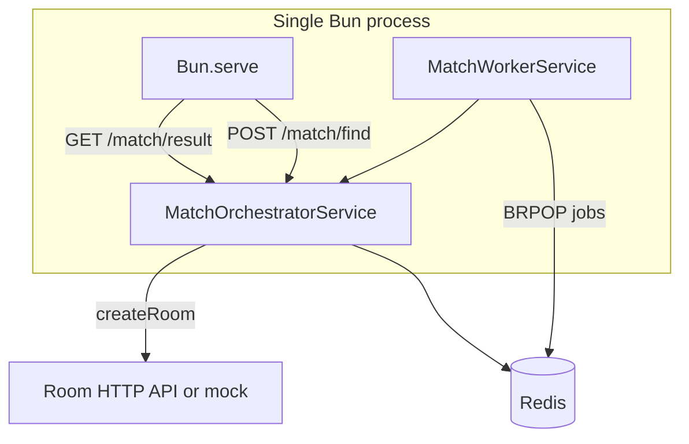

# Matching engine — full reference

**Doc path:** `docs/matching/matching-engine.md` (kebab-case). **Package:** `matching-service/`.

This document describes the **matching-service** package: architecture, Redis usage, HTTP API, configuration, and how each major module works. Use it alongside the source files under `matching-service/src/`.

> **Note:** Some diagrams and code excerpts below reflect an older folder layout; prefer the live tree under `matching-service/src/` (`http/`, `modules/simple-matching/`, `core/`, `shared/`).

---

## Table of contents

1. [Overview](#overview)
2. [Tech stack and running](#tech-stack-and-running)
3. [Repository layout](#repository-layout)
4. [Environment variables](#environment-variables)
5. [Configuration constants](#configuration-constants)
6. [Redis data model](#redis-data-model)
7. [Process architecture](#process-architecture)
8. [HTTP API](#http-api)
9. [End-to-end flows](#end-to-end-flows)
10. [Module reference (with code)](#module-reference-with-code)
11. [Domain: validation and scoring](#domain-validation-and-scoring)
12. [Room service integration](#room-service-integration)
13. [Concurrency: pair locking (Lua)](#concurrency-pair-locking-lua)
14. [User profile snapshots](#user-profile-snapshots)
15. [Exported public API](#exported-public-api)
16. [Operational notes](#operational-notes)

---

## Overview

The matching engine is a **Bun** HTTP service that:

- Accepts **find-match** requests (`userId` + `requestId`).
- Stores **match attempts** and a **global candidate pool** in **Redis**.
- Runs an **in-process background worker** that consumes jobs from a Redis list and tries to **pair** compatible users.
- Lets clients **poll** by `requestId` for `searching` → `matched` / `no_match`.

**Important:** User **profile snapshots** are read from Redis (`user:profile:snapshot:{userId}`). Another system (e.g. your main API) must write those JSON documents before matching can succeed.

---

## Tech stack and running

| Piece | Role |
|--------|------|
| **Bun** | Runtime + `Bun.serve` HTTP server |
| **ioredis** | Redis client |
| **pino** | Logging (`src/core/logger.ts`) |
| **dotenv** | Loaded via `src/config/load-env.ts` |

**Scripts** (`package.json`):

```json
"dev": "bun --watch src/app.ts",
"start": "bun run src/app.ts",
"typecheck": "bunx tsc --noEmit",
"test": "bun test",
"stress": "bun run scripts/stress-match.ts"
```

**Entry point:** `src/app.ts` — connects Redis, starts `MatchWorkerService`, registers routes, handles shutdown (`SIGINT` / `SIGTERM`).

---

## Repository layout

```
matching-service/
├── src/
│   ├── app.ts                          # Bootstrap: Redis, worker, HTTP
│   ├── config/
│   │   ├── constants.ts                # APP_CONFIG, MATCH_CONFIG, MATCH_SCORE_CONFIG
│   │   ├── env.ts                      # Env parsing
│   │   └── load-env.ts                 # dotenv
│   ├── contracts/
│   │   └── matchmaking.contracts.ts    # FindMatchRequest/Result, SnapshotUserProfile
│   ├── core/
│   │   └── logger.ts
│   ├── http/
│   │   ├── health.route.ts             # GET /health
│   │   └── matchmaking.route.ts        # POST /match/find, GET /match/result
│   ├── redis/
│   │   ├── client.ts                   # connect / getRedis / disconnect
│   │   ├── keys.ts                     # Key naming
│   │   └── scripts.ts                  # Lua (lockPair)
│   └── matchmaking/
│       ├── index.ts                    # Re-exports
│       ├── application/
│       │   ├── match-orchestrator.service.ts
│       │   └── match-worker.service.ts
│       ├── domain/
│       │   ├── matching.types.ts
│       │   ├── match-validator.service.ts
│       │   ├── match-score.service.ts
│       │   └── *.test.ts
│       └── infrastructure/
│           ├── parsers/snapshot.parser-utils.ts
│           ├── repositories/
│           │   ├── snapshot.repository.ts
│           │   └── match-attempt.repository.ts
│           └── services/
│               ├── match-pool.service.ts
│               ├── match-job-queue.service.ts
│               ├── match-lock.service.ts
│               └── room-orchestration.service.ts
├── scripts/
│   └── stress-match.ts                 # Load testing helper
├── package.json
├── tsconfig.json
└── (this doc: `docs/matching/matching-engine.md`)
```

---

## Environment variables

Defined in `src/config/env.ts`:

| Variable | Purpose | Default |
|----------|---------|---------|
| `NODE_ENV` | Environment name | `development` |
| `MATCHING_HOST` | HTTP bind host | `0.0.0.0` |
| `MATCHING_PORT` | HTTP port | `5060` |
| `REDIS_URL` | Redis connection URL | `redis://127.0.0.1:26379` |
| `REDIS_PING_TIMEOUT_MS` | Health check ping timeout | `800` |
| `ROOM_SERVICE_URL` | Base URL for room API (optional) | unset |
| `MATCHING_ROOM_MODE` | If `mock` or no URL, rooms are mocked | `mock` |

---

## Configuration constants

From `src/config/constants.ts`:

```typescript
export const APP_CONFIG = {
  serviceName: "matching-service",
  host: env.host,
  port: env.port,
} as const;

export const MATCH_CONFIG = {
  searchTimeoutMs: 25_000,
  lockTtlMs: 20_000,
  roomCreateTimeoutMs: 7_000,
  maxRetries: 3,
  retryBackoffMs: [500, 1_500, 3_500],
  candidateBatchSize: 25,
  attemptTtlSeconds: 120,
} as const;

export const MATCH_SCORE_CONFIG = {
  weights: {
    interests: 40,
    goals: 20,
    professions: 10,
    agePreference: 10,
    distancePreference: 10,
    preferredGender: 5,
    trustScore: 5,
  },
  minScoreToMatch: 35,
} as const;
```

---

## Redis data model

Key builders live in `src/redis/keys.ts`:

```typescript
export const redisKeys = {
  snapshot: (userId: string) => `user:profile:snapshot:${userId}`,
  poolGlobal: () => "mm:pool:global",
  userState: (userId: string) => `mm:state:${userId}`,
  userLock: (userId: string) => `mm:lock:user:${userId}`,
  pairLock: (userA: string, userB: string) => {
    const [low, high] = [userA, userB].sort();
    return `mm:pair:lock:${low}:${high}`;
  },
  matchJobQueue: () => "mm:jobs:find",
  attempt: (attemptId: string) => `mm:attempt:${attemptId}`,
  userLastAttempt: (userId: string) => `mm:user:last-attempt:${userId}`,
};
```

| Key pattern | Type | Meaning |
|-------------|------|---------|
| `user:profile:snapshot:{userId}` | String (JSON) | Normalized profile for validate/score |
| `mm:pool:global` | Sorted set | Members: userIds; score: enqueue timestamp |
| `mm:state:{userId}` | String | `searching` \| `free` \| `locked` \| `in_room` |
| `mm:lock:user:{userId}` | String | Lock held during pairing (PX TTL) |
| `mm:pair:lock:{low}:{high}` | String | Dedupes the same unordered pair |
| `mm:jobs:find` | List | JSON jobs `{ userId, requestId }` |
| `mm:attempt:{requestId}` | Hash | Attempt lifecycle + outcome |
| `mm:user:last-attempt:{userId}` | String | Last attempt id (TTL) |

---

## Process architecture



- **HTTP handlers** call `startFindMatch` / `getMatchResult` on a **singleton-style** orchestrator instance (see `matchmaking.route.ts`).
- **Worker** uses its **own** `MatchOrchestratorService` instance (separate from the HTTP one in the current code). Both talk to the **same Redis**, so state is shared.

---

## HTTP API

### `GET /health`

Returns JSON with Redis reachability; **503** if ping fails within `REDIS_PING_TIMEOUT_MS`.

```typescript
// src/http/health.route.ts (concept)
return Response.json({
  ok: redisOk,
  service: APP_CONFIG.serviceName,
  redis: redisOk ? "up" : "down",
  ts: Date.now(),
}, { status: statusCode });
```

### `POST /match/find`

**Body (JSON):** `{ "userId": string, "requestId": string }` (both non-empty strings).

**Success:** `{ ok: true, data: FindMatchResult }`

**Errors:** `400` invalid body; `500` internal.

### `GET /match/result/:requestId`

**Success:** `{ ok: true, data: FindMatchResult }`

**Result shapes** (`src/contracts/matchmaking.contracts.ts`):

```typescript
export type FindMatchRequest = {
  userId: string;
  requestId: string;
};

export type FindMatchResult =
  | { status: "matched"; roomId: string; peerUserId: string; matchScore: number }
  | { status: "searching"; retryAfterMs: number }
  | { status: "no_match"; reason: string };
```

---

## End-to-end flows

### A. Start search (`startFindMatch`)

1. If `mm:attempt:{requestId}` already exists → return stored result (**idempotent**).
2. Load snapshot for `userId`; missing → `no_match` / `snapshot_not_found`.
3. Read `mm:state:{userId}`; if `locked` or `in_room` → `no_match` / `user_unavailable`.
4. `setSearching` on attempt hash + TTL.
5. `pool.enqueue`: ZADD pool + SET state `searching`.
6. `jobs.enqueue`: LPUSH job payload.
7. Respond `{ status: "searching", retryAfterMs: 1000 }`.

### B. Worker processes job (`processMatchRequest`)

1. Load attempt; must be `searching` (otherwise return early / no-op path).
2. Re-validate snapshot and state (`in_room` → remove from pool, no_match).
3. Loop up to `maxRetries + 1` times:
   - `getCandidates`: ZREVRANGE pool (scan limit 100), filter others in `searching`, cap 25.
   - For each candidate: load snapshot; require **shared `matchIds`**; bidirectional **validate**; **score**; filter by `minScoreToMatch`.
   - Sort by match score desc, then pool score desc.
   - For each: `tryLockPair` → `createRoom` → on success mark `in_room` + `markMatched`; on room failure `releasePair` and continue.
   - Between retries: backoff + jitter.
4. If no match: `markNoMatch` / `no_compatible_candidate`, `pool.remove`.

### C. Poll result (`getMatchResult`)

Read attempt hash; map to `FindMatchResult` via `MatchAttemptRepository.toResult`.

---

## Module reference (with code)

### `src/app.ts` — bootstrap and routing

```typescript
import { APP_CONFIG } from "@/config/constants";
import { healthResponse } from "@/http/health.route";
import { handleFindMatch, handleGetMatchResult } from "@/http/matchmaking.route";
import { logger } from "@/core/logger";
import { connectRedis, disconnectRedis } from "@/redis/client";
import { MatchWorkerService } from "@/matchmaking/application/match-worker.service";

const worker = new MatchWorkerService();

const bootstrap = async (): Promise<void> => {
  await connectRedis();
  worker.start();
  // ... shutdown hooks ...

  const server = Bun.serve({
    port: APP_CONFIG.port,
    hostname: APP_CONFIG.host,
    async fetch(request: Request): Promise<Response> {
      const url = new URL(request.url);
      if (url.pathname === "/health") return healthResponse();
      if (request.method === "POST" && url.pathname === "/match/find")
        return handleFindMatch(request);
      if (request.method === "GET" && url.pathname.startsWith("/match/result/")) {
        const requestId = decodeURIComponent(url.pathname.replace("/match/result/", ""));
        return handleGetMatchResult(requestId);
      }
      return new Response("Matching Service", { status: 200 });
    },
  });
};
```

### `src/http/matchmaking.route.ts` — HTTP → orchestrator

```typescript
const orchestrator = new MatchOrchestratorService();

export const handleFindMatch = async (request: Request): Promise<Response> => {
  const body = await parseBody(request);
  if (!body) {
    return Response.json(
      { ok: false, error: "invalid_body", hint: "expected { userId, requestId }" },
      { status: 400 },
    );
  }
  const result = await orchestrator.startFindMatch(body);
  return Response.json({ ok: true, data: result }, { status: 200 });
};

export const handleGetMatchResult = async (requestId: string): Promise<Response> => {
  const result = await orchestrator.getMatchResult(requestId);
  return Response.json({ ok: true, data: result }, { status: 200 });
};
```

### `src/matchmaking/application/match-worker.service.ts` — job loop

```typescript
export class MatchWorkerService {
  private isRunning = false;

  constructor(
    private readonly queue = new MatchJobQueueService(),
    private readonly orchestrator = new MatchOrchestratorService(),
  ) {}

  start(): void {
    if (this.isRunning) return;
    this.isRunning = true;
    void this.runLoop();
  }

  stop(): void {
    this.isRunning = false;
  }

  private async runLoop(): Promise<void> {
    while (this.isRunning) {
      try {
        const job = await this.queue.dequeue(2);
        if (!job) continue;
        await this.orchestrator.processMatchRequest(job);
      } catch (error) {
        logger.error("Match worker failed to process job", { error: String(error) });
      }
    }
  }
}
```

### `MatchOrchestratorService` — core logic (abbreviated)

**Dependencies (constructor):** `MatchPoolService`, `MatchValidatorService`, `MatchScoreService`, `MatchJobQueueService`, `MatchLockService`, `SnapshotRepository`, `MatchAttemptRepository`, `RoomOrchestrationService`.

**`startFindMatch`:** idempotency, snapshot, state gate, `setSearching`, `pool.enqueue`, `jobs.enqueue`, return searching.

**`processMatchRequest`:** load candidates, score/validate loop, lock, `createRoom`, `markPairInRoom` on success (pipeline: ZREM both from pool, DEL locks, SET state `in_room`), or `releasePair` on room failure.

**`markPairInRoom` (private):**

```typescript
private async markPairInRoom(userA: string, userB: string): Promise<void> {
  const redis = getRedis();
  const pipeline = redis.pipeline();
  pipeline.zrem(redisKeys.poolGlobal(), userA);
  pipeline.zrem(redisKeys.poolGlobal(), userB);
  pipeline.del(redisKeys.userLock(userA));
  pipeline.del(redisKeys.userLock(userB));
  pipeline.del(redisKeys.pairLock(userA, userB));
  pipeline.set(redisKeys.userState(userA), "in_room");
  pipeline.set(redisKeys.userState(userB), "in_room");
  await pipeline.exec();
}
```

### `MatchPoolService` — global pool

```typescript
export class MatchPoolService {
  async enqueue(userId: string): Promise<void> {
    const redis = getRedis();
    const now = Date.now();
    const pipeline = redis.pipeline();
    pipeline.zadd(redisKeys.poolGlobal(), now, userId);
    pipeline.set(redisKeys.userState(userId), "searching");
    await pipeline.exec();
  }

  async remove(userId: string): Promise<void> {
    const redis = getRedis();
    const pipeline = redis.pipeline();
    pipeline.zrem(redisKeys.poolGlobal(), userId);
    pipeline.set(redisKeys.userState(userId), "free");
    await pipeline.exec();
  }

  async getCandidates(requesterId: string): Promise<MatchCandidate[]> {
    const redis = getRedis();
    const rows = await redis.zrevrange(redisKeys.poolGlobal(), 0, CANDIDATE_SCAN_LIMIT - 1, "WITHSCORES");
    // ... skip self, require state === "searching", cap MAX_CANDIDATES ...
  }
}
```

Constants: `CANDIDATE_SCAN_LIMIT = 100`, `MAX_CANDIDATES = 25`.

### `MatchJobQueueService` — Redis list queue

```typescript
export class MatchJobQueueService {
  async enqueue(request: FindMatchRequest): Promise<void> {
    await getRedis().lpush(redisKeys.matchJobQueue(), JSON.stringify(request));
  }

  async dequeue(blockSeconds = 2): Promise<FindMatchRequest | null> {
    const result = await getRedis().brpop(redisKeys.matchJobQueue(), blockSeconds);
    // ... parse JSON ...
  }
}
```

### `MatchAttemptRepository` — attempt hash + TTL

Fields include: `attemptId`, `userId`, `status` (`searching` | `matched` | `no_match`), `roomId`, `peerUserId`, `matchScore`, `reason`, timestamps.

- `setSearching` / `markMatched` / `markNoMatch` update hash and refresh `EXPIRE` using `MATCH_CONFIG.attemptTtlSeconds`.
- Also sets `mm:user:last-attempt:{userId}` for convenience.

### `SnapshotRepository` — JSON from Redis → `SnapshotUserProfile`

- `GET user:profile:snapshot:{userId}`
- Parse JSON; map nested `user`, `location`, `preferences`, `behavior`, arrays (`interests`, `goals`, etc.) into `SnapshotUserProfile` with `filters` and `attributes` records plus `matchIds` from `buildMatchIds`.

### `MatchLockService` — Lua-backed atomic pair lock

```typescript
export class MatchLockService {
  async tryLockPair(userA: string, userB: string, attemptId: string): Promise<boolean> {
    const redis = getRedis();
    const [lowUserId, highUserId] = orderedUserIds(userA, userB);
    const result = await redis.eval(
      redisScripts.lockPair,
      5,
      redisKeys.userLock(lowUserId),
      redisKeys.userLock(highUserId),
      redisKeys.pairLock(lowUserId, highUserId),
      redisKeys.userState(lowUserId),
      redisKeys.userState(highUserId),
      attemptId,
      String(MATCH_CONFIG.lockTtlMs),
      "searching",
      "locked",
    );
    return Number(result) === 1;
  }

  async releasePair(userA: string, userB: string): Promise<void> {
    // DEL pair + user locks; SET both states back to "searching"
  }
}
```

---

## Domain: validation and scoring

### `MatchValidatorService`

- **`accepts(requesterFilters, candidateAttributes)`** — age range, `distancePreference` (`same_city` / `same_region` / `same_country` / `random`).
- **`isBidirectionallyCompatible(a, b)`** — `accepts(a.filters, b.attributes) && accepts(b.filters, a.attributes)`.

### `MatchScoreService`

- **`calculateDirectionalScore(requester, candidate)`** — weighted blend of:
  - Jaccard-style overlap on interests, goals, professions
  - Age fit, distance preference, preferred gender, trust score
- **`calculateBidirectionalScore`** — average of both directions, rounded.
- **`isScoreEligible(score)`** — `score >= MATCH_SCORE_CONFIG.minScoreToMatch`.

### `src/matchmaking/domain/matching.types.ts`

```typescript
export type MatchState = "free" | "searching" | "locked" | "matched" | "in_room";

export type MatchCandidate = {
  userId: string;
  score: number;
};
```

---

## Room service integration

`RoomOrchestrationService` (`src/matchmaking/infrastructure/services/room-orchestration.service.ts`):

- If `env.roomServiceMode === "mock"` **or** `env.roomServiceUrl` is unset → returns synthetic `roomId`:
  - `mock-room:{sortedPair}:{attemptId}`
- Else `POST {ROOM_SERVICE_URL}/rooms/match` with JSON body:
  - `{ attemptId, pairId, users: [requesterId, peerUserId] }`
- Uses `MATCH_CONFIG.roomCreateTimeoutMs` as fetch timeout.

---

## Concurrency: pair locking (Lua)

Script in `src/redis/scripts.ts` (`redisScripts.lockPair`):

- Abort if pair lock already exists.
- Abort if either user lock exists.
- Require both user states equal **`searching`**.
- `SET` user locks with `PX` + `NX` (attempt id as value); roll back on failure.
- `SET` pair lock `NX`; on failure delete user locks.
- Set both user states to **`locked`**.
- Returns `1` on success, `0` on failure.

This prevents two workers from matching the same user simultaneously without a race.

---

## User profile snapshots

### `matchIds` (compatibility gate)

From `snapshot.parser-utils.ts`:

```typescript
export const buildMatchIds = (
  interestIds: string[],
  goalIds: string[],
  professionIds: string[],
): string[] => {
  return unique([
    ...interestIds.map((id) => `interest:${id}`),
    ...goalIds.map((id) => `goal:${id}`),
    ...professionIds.map((id) => `profession:${id}`),
  ]);
};
```

The orchestrator requires **`hasSharedMatchId(requesterSnapshot.matchIds, candidateSnapshot.matchIds)`** before validate/score — users must share at least one prefixed id.

### `SnapshotUserProfile` (contract)

```typescript
export type SnapshotUserProfile = {
  userId: string;
  matchIds: string[];
  filters: Record<string, unknown>;
  attributes: Record<string, unknown>;
  version: number;
  updatedAt: number;
};
```

---

## Exported public API

`src/matchmaking/index.ts` re-exports:

- `MatchOrchestratorService`
- `MatchValidatorService`, `MatchScoreService`
- Types: `MatchAttempt`, `MatchCandidate`, `MatchState`
- `MatchLockService`, `MatchPoolService`, `RoomOrchestrationService`
- `SnapshotRepository`, `MatchAttemptRepository`

Useful if another package imports matching logic as a library.

---

## Operational notes

1. **Two orchestrator instances** — HTTP and worker each construct `MatchOrchestratorService`; behavior is correct because state lives in Redis, but logs/debuggers should account for two objects in one process.
2. **Job ordering** — `LPUSH` + `BRPOP` is FIFO for a single consumer; multiple processes would need a clear scaling story (not implemented here).
3. **Pool ordering** — `ZREVRANGE` with timestamp scores tends to prefer **newer** pool members first; match score dominates ordering after fetch.
4. **Attempt TTL** — Attempts expire after `attemptTtlSeconds` (120s); clients should poll within that window.
5. **Stress testing** — `bun run scripts/stress-match.ts` (see `scripts/stress-match.ts` for usage against local service).

---

## Quick file index

| Concern | Primary file |
|---------|----------------|
| Routes / server | `src/app.ts`, `src/http/*.ts` |
| Start vs worker processing | `src/matchmaking/application/match-orchestrator.service.ts` |
| Worker loop | `src/matchmaking/application/match-worker.service.ts` |
| Pool / queue / lock | `src/matchmaking/infrastructure/services/match-*.service.ts` |
| Attempts / snapshots | `src/matchmaking/infrastructure/repositories/*.ts` |
| Validate / score | `src/matchmaking/domain/match-validator.service.ts`, `match-score.service.ts` |
| Redis | `src/redis/client.ts`, `keys.ts`, `scripts.ts` |
| Types / API contract | `src/contracts/matchmaking.contracts.ts` |

---

*Documents the `matching-service` package. When behavior changes in code, update this file or regenerate sections from source.*
