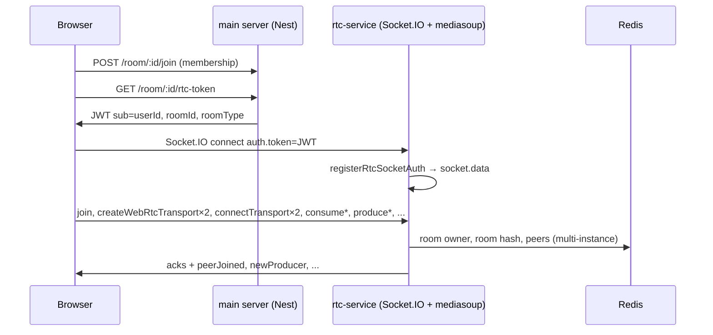

# RTC / WebRTC / mediasoup (SFU) — full stack reference (start → bottom)

**Path style:** `rtc-service` references below use **kebab-case file names with extension** (for example `create-app.ts`, `socket-jwt.middleware.ts`, `mediasoup-events.ts`).

This document is the **single deep reference** for how calling works: **room route → Redux → JWT → Socket.IO → mediasoup Router/Transport/Producer/Consumer → React streams → direct vs circle UI**.  
Mediasoup behavior is **the same** for direct (1:1) and circle (group); **only client layout, roster rules, and some policies differ**.

> **हिंदी संक्षेप:** पूरा रास्ता एक ही है — मुख्य सर्वर JWT देता है, **rtc-service** में **mediasoup** मीडिया रूट करता है। **Direct** और **Circle** दोनों में SFU का कोड एक जैसा; फर्क सिर्फ **UI** (गैलरी बनाम एक मुख्य रिमोट) और **कौन-सा track कहाँ दिखे** जैसे नियमों में है।

---

## Table of contents

1. [Concepts](#1-concepts-short)
2. [Who talks to whom (diagram)](#2-who-talks-to-whom)
3. [Start → bottom: application path to “mediasoup ready”](#3-start--bottom-application-path-to-mediasoup-ready)
4. [rtc-service process boot (every startup step)](#4-rtc-service-process-boot-every-startup-step)
5. [JWT and socket authentication](#5-jwt-and-socket-authentication)
6. [Server: room registry + Router + `PeerSessionService` API](#6-server-room-registry--router--peersessionservice-api)
7. [Socket.IO: request events (client → server)](#7-socketio-request-events-client--server)
8. [Socket.IO: server pushes (server → client)](#8-socketio-server-pushes-server--client)
9. [Client: `useMediasoupRoomSession` (join, transports, consume)](#9-client-usemediasouproomsession-join-transports-consume)
10. [Client: `useMediasoupLocalMedia` (produce, pause, screen)](#10-client-usemediasouplocalmedia-produce-pause-screen)
11. [Client: `useMediasoupRoom` (compose streams for UI)](#11-client-usemediasouproom-compose-streams-for-ui)
12. [Direct vs circle: what is identical vs what differs](#12-direct-vs-circle-what-is-identical-vs-what-differs)
13. [Direct → circle “expand in place” (without killing mediasoup)](#13-direct--circle-expand-in-place-without-killing-mediasoup)
14. [Room video UI: `useRoomVideoViewModel` and gallery camera-only](#14-room-video-ui-useroomvideoviewmodel-and-gallery-camera-only)
15. [Debugging checklist](#15-debugging-checklist)
16. [Related docs & file index](#16-related-docs--file-index)

---

## 1) Concepts (short)

| Term | Meaning here |
|------|----------------|
| **WebRTC** | Browser APIs + ICE/DTLS/SRTP to move media between browser and SFU. |
| **SFU** | Selective Forwarding Unit: each sender **one** upstream; SFU forwards RTP to each subscriber’s **consumer**. Implemented by **mediasoup**. |
| **Worker** | mediasoup OS process pool entry; **Routers** are created on a Worker (`createWorker` → `worker.createRouter`). |
| **Router** | Codec routing plane for one logical room on this machine; **Producers** and **Consumers** attach to it. |
| **WebRtcTransport** | Browser ↔ mediasoup ICE/DTLS session. We use **recv** + **send** per user. |
| **Producer** | Inbound from browser to SFU (on **send** transport). |
| **Consumer** | Outbound from SFU to browser (on **recv** transport). |
| **`appData`** | JSON on producer; we set **`mediaSource`**: `"camera"` \| `"screen"` for video so **`consume`** ack and **`newProducer`** can label tracks. |

---

## 2) Who talks to whom

---

## 3) Start → bottom: application path to “mediasoup ready”

### 3.1 Route and room data

1. User opens **`/circle/[roomId]`** → **`RoomPage`** (`client/src/features/room/pages/room-page.tsx`).
2. **`useRoom()`** loads room + match context (`peerId`, `score`, `room`, `rtcRoomType` from API/cache).
3. **`isCircleRoom = isRoomGroupLayout(room, rtcRoomType)`** — decides **group vs direct layout** for UI only.
4. **`shouldStartVideo`** — for circle, room enough; for direct, **`peerId`** should exist (match context).

### 3.2 Join HTTP room, then Redux “video session”

5. **`useRoomJoinAndStartVideo`** (`client/src/features/room/hooks/use-room-join-and-start-video.ts`):  
   - **`joinRoom(roomId)`** → POST app **`/room/:id/join`**.  
   - On success: **`markRoomActive()`**, **`dispatch(startVideoSession({ roomId, primaryRemoteUserId: peerId }))`**.  
6. Redux **`sessionActive`**, **`activeRoomId`**, **`rtcPrimaryRemoteUserId`** (direct: preferred main remote) now set (`room-slice`).

### 3.3 RTC token + socket (still before mediasoup join)

7. **`RtcSocketProvider`** (`client/src/features/rtc/providers/rtc-socket-provider.tsx`):  
   - Reads **`selectActiveRoomId`**, **`selectIsVideoSessionActive`**, **`selectRtcPrimaryRemoteUserId`**.  
   - **`useGetRtcTokenQuery(activeRoomId)`** (`rtc-api.ts`) → main API RTC token.  
   - **`deriveRoomRtcState`** (`derive-room-rtc-state.ts`) maps loading/error/token for lobby UI.  
8. **`useRtcSocket(rtc.rtcToken)`** (`use-rtc-socket.ts`): **`io(RTC_SOCKET_URL, { auth: { token } })`**.  
9. **`mediasoupEnabled = sessionActive && activeRoomId && rtcSocketState === "connected"`**.

### 3.4 Mediasoup hooks composition

10. **`useMediasoupRoom({ enabled: mediasoupEnabled, rtcSocket, rtcRoomId, rtcRoomType, localUserId, preferredRemotePeerId, ... })`** (`use-mediasoup-room.ts`):  
    - State: `status`, `remoteStreamsByPeerId`, `peers`, `remoteTrackMediaSource`, toggles, etc.  
    - **`useMediasoupRoomSession`** — signaling + consume (no `getUserMedia`).  
    - **`useMediasoupLocalMedia`** — produce mic/camera/screen.  
    - Memos: **`remoteParticipants`**, **`screenShareTiles`**, **`remoteStream`**, **`mainStageShowsScreen`**, **`remotePeerCameraStream`**, **`localPreviewStream`**.  
11. When **`useMediasoupRoomSession`** finishes **`existingProducers`** consumption and transport is stable → **`status === "ready"`** → toggles work.

### 3.5 UI wiring

12. **`RoomVideoLayer`** → **`useRtcSocketContext()`** → passes streams + **`isGroupRoom`** into **`RoomVideoView`**.  
13. **`useRoomVideoViewModel`** builds refs, **`groupGalleryParticipants`** (circle), screen-share layout flags.

**Important:** Steps 1–6 are **app room membership + UI intent**. Steps 7–11 are **rtc-service + mediasoup**. Failing step 6 does not open the socket; failing step 10 leaves **`status`** not `ready`.

---

## 4) rtc-service process boot (every startup step)

File: **`rtc-service/src/index.ts`** (bootstrap; HTTP app factory: **`rtc-service/src/http/create-app.ts`**)

| Order | Function / call | Purpose |
|------|------------------|---------|
| 1 | **`connectRedis()`** | Multi-instance room ownership + peer keys. |
| 2 | **`initializeMediasoup()`** (`core/mediasoup/mediasoup.service.ts`) | **`createWorker`**, port range, **`worker.on("died")`**. |
| 3 | **`serve({ fetch: app.fetch, ... })`** Hono | Health + internal routes from **`createApp()`**. |
| 4 | **`new Server(httpServer)`** Socket.IO | CORS, websocket upgrade. |
| 5 | **`registerRtcSocketAuth(io)`** | JWT middleware on connection. |
| 6 | **`registerSignalingHandlers(io)`** (`modules/rtc/signaling/io-signaling.ts`) | **`new PeerSessionService()`**, per-socket **`registerMediasoupSocketHandlers`**, returns `peers`. |
| 7 | **`registerInternalPeers(peers)`** (`modules/rtc/internal/global-peer-session.ts`) | Internal API can call **`setRoomTypeForRoomPeers`**. |

**Router creation does not happen at boot** — it happens on first **`join`** for a room via **`getOrCreateLocalRoom`**.

---

## 5) JWT and socket authentication

### Main API — token contents

- **`signRtcJwtForRoom`** (`server/src/core/rtc/rtc-jwt.ts`): claims **`roomId`**, **`roomType`** (`RoomSessionType`), **`sub`** = `userId`, expiry ~15m.  
- **`issueRtcTokenService`** validates room live + participant, then signs.

### rtc-service — handshake

- **`registerRtcSocketAuth`** (`rtc-service/src/middleware/socket-jwt.middleware.ts`): reads **`handshake.auth.token`** (or query), **`jwtVerify`**, sets **`socket.data.userId`**, **`roomId`**, **`roomType`**.  
- All **`mediasoup-events`** handlers read **`userId`** from **`socket.data`** for ack’d operations.

---

## 6) Server: room registry + Router + `PeerSessionService` API

### 6.1 `getOrCreateLocalRoom` / `releaseRoom`

File: **`rtc-service/src/modules/rtc/room/room-registry.ts`**

| Function | mediasoup / side effects |
|----------|---------------------------|
| **`getOrCreateLocalRoom(roomId)`** | If this instance owns Redis key → ensure **`localRooms`** has **`{ roomId, router }`**; else **`createRouter()`** via **`mediasoup.service`**. Wrong owner → **`WRONG_INSTANCE`**. |
| **`releaseRoom(roomId)`** | If owner, delete Redis keys; **`router.close()`**, remove from **`localRooms`**. |
| **`getLocalRoom(roomId)`** | Read in-memory **`LocalRoom`**. |

### 6.2 `PeerSessionService` — methods ↔ mediasoup

File: **`rtc-service/src/modules/rtc/peer/peer.service.ts`**

| Method | mediasoup calls | Emits / side effects |
|--------|-----------------|----------------------|
| **`join(socket, displayName?, image?)`** | **`roomService.getOrCreateLocalRoom`** → **`router`** exists | **`socket.join(roomId)`**, Redis peer save, **`peerJoined`**, returns **`rtpCapabilities`**, **`existingProducers`** via **`collectProducersInRoom`**. |
| **`createWebRtcTransport(userId, direction)`** | **`localRoom.router.createWebRtcTransport({ listenInfos, ... })`** | Stores transport on session; returns ICE/DTLS params. |
| **`connectTransport`** | **`transport.connect({ dtlsParameters })`** | — |
| **`restartIce`** | **`transport.restartIce()`** | Returns new **`iceParameters`**. |
| **`produce`** | **`transport.produce({ kind, rtpParameters, appData })`** | Stores producer; **`newProducer`** to room; Redis media event **`producer_added`**. |
| **`pauseProducer` / `resumeProducer`** | **`producer.pause()` / `resume()`** | **`producerPaused` / `producerResumed`** to room with **`mediaSource`** from **`mediaSourceFromProducerAppData`**. |
| **`closeProducer`** | **`producer.close()`**, delete map | **`producerClosed`** to room; Redis **`producer_removed`**. |
| **`consume`** | **`transport.consume({ producerId, rtpParameters, paused })`** (router validates via **`canConsume`**) | Stores consumer; ack includes **`mediaSource`** for video via **`mediaSourceFromProducerAppData`** on producer/consumer appData. |
| **`resumeConsumer`** | **`consumer.resume()`** | — |
| **`leave` / `onSocketDisconnect`** | Close transports, **`removeSession`** | **`peerLeft`**, **`producerClosed`** per producer, Redis cleanup, maybe **`releaseRoom`**. |
| **`setRoomTypeForRoomPeers`** | *none* | Updates **`socket.data.roomType`** for all sockets in Socket.IO room (in-place direct→circle UX). |

### 6.3 `mediaSource` on server

File: **`rtc-service/src/modules/rtc/peer/media-source.ts`**

- **`mediaSourceFromProducerAppData(appData)`** → **`"screen"`** only if **`appData.mediaSource === "screen"`** (strict); else **`"camera"`**.  
- Client normalizes looser strings on **`newProducer`** / pause events; **consume ack** uses producer appData from SFU.

---

## 7) Socket.IO: request events (client → server)

Registration: **`registerMediasoupSocketHandlers`** (`rtc-service/src/modules/rtc/signaling/mediasoup-events.ts`).  
Payload parsing: **`socket-payloads.ts`** (same folder).

| Event | Parser | Server handler |
|-------|--------|----------------|
| **`join`** | displayName/image from payload | **`peers.join`** |
| **`createWebRtcTransport`** | **`parseCreateWebRtcTransportPayload`** → `"send"` \| `"recv"` | **`peers.createWebRtcTransport`** |
| **`connectTransport`** | **`parseConnectTransportPayload`** | **`peers.connectTransport`** |
| **`restartIce`** | **`parseRestartIcePayload`** | **`peers.restartIce`** |
| **`produce`** | **`parseProducePayload`** (kind, rtpParameters, **appData**) | **`peers.produce`** |
| **`pauseProducer`** / **`resumeProducer`** | **`parsePauseResumeProducerPayload`** | **`peers.pauseProducer`** / **`resumeProducer`** |
| **`closeProducer`** | **`parseCloseProducerPayload`** | **`peers.closeProducer`** |
| **`consume`** | **`parseConsumePayload`** (recv **transportId**, producerId, **device rtpCapabilities**, paused) | **`peers.consume`** |
| **`resumeConsumer`** | **`parseResumeConsumerPayload`** | **`peers.resumeConsumer`** |
| **`leave`** | — | **`peers.leave`** |

Client ack helper: **`emitRtcAck`** (`client/src/features/rtc/lib/rtc-signaling.ts`) — 35s timeout, single callback ack.

---

## 8) Socket.IO: server pushes (server → client)

| Event | When | Typical client handler |
|-------|------|-------------------------|
| **`peerJoined`** | After remote **`join`** | **`onPeerJoined`** → merge **`peers`**. |
| **`peerLeft`** | Disconnect / **`leave`** / **`removeSession`** | Remove **`peers`** + **`remoteStreamsByPeerId`**. |
| **`newProducer`** | After **`produce`** | **`onNewProducer`** → **`consumeRemoteProducer`**. |
| **`producerClosed`** | **`closeProducer`** or session teardown | **`detachConsumer`** / local screen cleanup. |
| **`producerPaused`** / **`producerResumed`** | Pause/resume producer | Update **`peers.cameraActive`** / mic flags (camera vs screen aware on client). |

---

## 9) Client: `useMediasoupRoomSession` (join, transports, consume)

File: **`client/src/features/rtc/hooks/use-mediasoup-room-session.ts`**

**Effect when `enabled && socket connected`:**

1. Reset state/refs; register **`peerJoined`**, **`peerLeft`**, **`producerPaused`**, **`producerResumed`**.  
2. **`emitRtcAck("join", { displayName, image })`**.  
3. **`new Device().load({ routerRtpCapabilities })`**.  
4. **`createWebRtcTransport` recv** → **`device.createRecvTransport`** → **`wireTransportConnect`**, **`attachIceRecovery`**.  
5. **`createWebRtcTransport` send** → **`device.createSendTransport`** → **`wireTransportConnect`**, **`wireSendTransportProduce`**, **`attachIceRecovery`**.  
6. Register **`newProducer`**, **`producerClosed`**.  
7. For each **`joinRes.existingProducers`**: **`producerMediaSourceFromSocket`** → **`consumeRemoteProducer`**.  
8. **`setStatus("ready")`**.

**`consumeRemoteProducer`:** **`emitRtcAck("consume")`** → **`recvTransport.consume`** → **`setRemoteTrackMediaSource`** via **`resolveInboundVideoMediaSource`** → **`addRemoteTrackForPeer`** → **`resumeConsumer`** if needed.

**`wireTransportConnect` / `wireSendTransportProduce`:** `client/src/features/rtc/lib/mediasoup-transport-wiring.ts` — bridges mediasoup-client events to **`connectTransport`** / **`produce`** acks.

**ICE recovery:** `maybeRestartTransportIce` → **`restartIce`** ack → **`transport.restartIce`**.

---

## 10) Client: `useMediasoupLocalMedia` (produce, pause, screen)

File: **`client/src/features/rtc/hooks/use-mediasoup-local-media.ts`**

- Guards: **`statusRef.current === "ready"`**, **`sendTransportRef`**, **`deviceRef`**.  
- **Mic/camera:** `getUserMedia` or pause/resume track + **`pauseProducer`** / **`resumeProducer`** / **`produce`** with **`appData.mediaSource: "camera"`** (video).  
- **Screen:** `getDisplayMedia`, **`appData.mediaSource: "screen"`**, **`cleanupLocalScreenShare`** → **`closeProducer`** ack.  
- Stream helpers: **`mergeLocalCameraTrack`**, **`rebuildLocalStreamWithoutKind`**, etc. (`mediasoup-stream-helpers.ts`).

---

## 11) Client: `useMediasoupRoom` (compose streams for UI)

File: **`client/src/features/rtc/hooks/use-mediasoup-room.ts`**

| Output | Built by |
|--------|----------|
| **`remoteParticipants`** | **`remoteParticipantsFromRecord(remoteStreamsByPeerId, peers)`** |
| **`primaryRemoteStream`** | **`pickPrimaryRemoteStream(remoteParticipants, preferredRemotePeerId)`** |
| **`screenShareTiles`** | **`collectScreenShareTiles({...})`** (`screen-share-stage.ts`) |
| **`orderedScreenKeys` / focus** | **`stableSortedScreenShareKeys`**, **`effectiveScreenShareFocusKey`**, user pin |
| **`remoteStream`** (main stage) | If any share tile: **`buildMainStageStreamForScreenFocus`**; else **`buildDirectCallMainStageStream`** |
| **`mainStageShowsScreen`** | **`mainStageIsScreenShareVideo`** or **`directCallMainStageShowsScreen`** |
| **`remotePeerCameraStream`** | **`buildDirectPeerCameraInsetForScreenFocus`** or **`buildDirectCallRemotePeerCameraStream`** |
| **`localPreviewStream`** | **`buildLocalPreviewStream(localStream, localScreenTrackId)`** |

**`rtcRoomType`** flows into **`rtcRoomTypeRef`** for policy inside local media / stage builders (`"direct"` \| `"circle"` from token/API).

---

## 12) Direct vs circle: what is identical vs what differs

### Identical (same mediasoup & hooks)

- Same **`join`**, transports, **`produce`**, **`consume`**, **`peerJoined`**, **`newProducer`**, etc.  
- Same per-peer **`MediaStream`** aggregation in **`remoteStreamsByPeerId`**.  
- Same **`remoteTrackMediaSource`** map for camera vs screen video.

### Differs (client only)

| Topic | Direct (1:1 layout) | Circle (group) |
|-------|---------------------|----------------|
| **Primary remote** | **`pickPrimaryRemoteStream(..., rtcPrimaryRemoteUserId)`** from Redux | Gallery: use **all** peers; stage may still use focus stream when sharing |
| **Roster** | Effectively one “main” remote + self | **`mergeGroupGalleryParticipants(remotePeers, remoteParticipants)`** so tiles exist before tracks |
| **Gallery camera-only** | N/A (or subset) | **`useRoomVideoViewModel.groupGalleryParticipants`**: **`cameraOnlyParticipantStream`**, exclude screen tile track ids (**`videoTrackIdsFromScreenShareTilesForPeer`**) |
| **Screen share button** | **`canUseScreenShare`** true for **`direct`** and **`circle`** (`screen-share-policy.ts`) | Same |
| **Skip / partner disconnect** | **`DirectCallPartnerDisconnectHandler`**, **`beginSearchingNextCall`** | Not used for group |
| **UI flags** | **`RoomPage`** / **`RoomVideoLayer`** `isGroupRoom === false` | `isGroupRoom === true` |

**No separate rtc-service “mode”** — only **`roomType`** on JWT / socket.data for client policy and product behavior.

---

## 13) Direct → circle “expand in place” (without killing mediasoup)

Two channels:

1. **Main app** may call internal **`POST /internal/webhook/room-room-type`** on rtc-service (`rtc-service/src/modules/rtc/internal/room-webhooks.ts`) → **`PeerSessionService.setRoomTypeForRoomPeers(roomId, roomType)`** → updates **`socket.data.roomType`** for everyone still connected. **Transports/producers stay alive.**

2. **Client** **`RoomDirectExpandSocketBridge`**: on “room became circle”, **`patchCachedRtcRoomType("circle")`** on **`getRtcToken`** cache — comment in code: **do not invalidate `RtcToken`** or the rtc socket reconnect would **tear down mediasoup** for the room.

File: `client/src/features/room/components/room-direct-expand-socket-bridge.tsx`

---

## 14) Room video UI: `useRoomVideoViewModel` and gallery camera-only

File: `client/src/features/room/hooks/use-room-video-view-model.ts`

- **`remoteVideoRef` / `localVideoRef` / `peerCameraInsetRef`** + **`useAttachMediaStream`**.  
- **`groupGalleryParticipants`**: if **`isGroupRoom`**, **`mergeGroupGalleryParticipants`**, then for each participant strip screen tracks from the tile stream via **`cameraOnlyParticipantStream`** and **`excludeVideoTrackIds`** from **`videoTrackIdsFromScreenShareTilesForPeer`**.  
- **`screenShareMainLayout`**: group + active share tiles → stage layout uses filmstrip/main share.  
- **`showScreenShare`**: gated by **`canUseScreenShare(rtcRoomType)`** and toggle callbacks.

This layer **does not** call mediasoup; it **re-slices `MediaStream`s** already produced/consumed.

---

## 15) Debugging checklist

1. **HTTP join** succeeded (`useRoomJoinAndStartVideo`).  
2. **`sessionActive`** + **`activeRoomId`** set.  
3. **RTC token** query success; JWT **`roomId`** matches route.  
4. **Socket** `connected`; no JWT verify errors on rtc-service.  
5. **`join`** ack ok; not **`WRONG_INSTANCE`**.  
6. **Transports** connected (ICE state).  
7. **`produce`** → others see **`newProducer`** → **`consume`** → tracks in **`remoteStreamsByPeerId`**.  
8. **`remoteTrackMediaSource`** correct when multiple video producers per peer.  
9. **Circle gallery** — if black tiles, verify **`groupGalleryParticipants`** exclusions and consume **`mediaSource`** on server.

---

## 16) Related docs & file index

### Related docs

- `docs/realtime/webrtc-direct-and-circle-call-flow.md` — UX-oriented direct vs circle.
- `docs/realtime/video-calling-architecture-and-debugging.md` — Redux, skip/end, broader file map.
- `docs/matching/matching-engine.md` — matching engine / how users get a **`roomId`**.

### File index (bookmark)

| Area | Path |
|------|------|
| Room route | `client/src/features/room/pages/room-page.tsx` |
| Join + start session | `client/src/features/room/hooks/use-room-join-and-start-video.ts` |
| Video orchestration | `client/src/features/room/components/room-video-layer.tsx` |
| View model | `client/src/features/room/hooks/use-room-video-view-model.ts` |
| Expand bridge | `client/src/features/room/components/room-direct-expand-socket-bridge.tsx` |
| RTC provider | `client/src/features/rtc/providers/rtc-socket-provider.tsx` |
| Mediasoup hooks | `client/src/features/rtc/hooks/use-mediasoup-room.ts`, `use-mediasoup-room-session.ts`, `use-mediasoup-local-media.ts` |
| Signaling util | `client/src/features/rtc/lib/rtc-signaling.ts`, `mediasoup-transport-wiring.ts` |
| Stage math | `client/src/features/rtc/lib/screen-share-stage.ts`, `direct-call-stage.ts` |
| Stream helpers | `client/src/features/rtc/lib/mediasoup-stream-helpers.ts`, `remote-participant-streams.ts` |
| RTC token API | `client/src/features/rtc/api/rtc-api.ts`, `derive-room-rtc-state.ts` |
| Issue token | `server/src/modules/rooms/services/issue-rtc-token.service.ts`, `server/src/core/rtc/rtc-jwt.ts` |
| rtc-service boot | `rtc-service/src/index.ts`, `rtc-service/src/http/create-app.ts` |
| mediasoup worker/router | `rtc-service/src/core/mediasoup/mediasoup.service.ts` |
| Room registry | `rtc-service/src/modules/rtc/room/room-registry.ts`, `rtc-service/src/modules/rtc/room/room.service.ts` |
| Peer session | `rtc-service/src/modules/rtc/peer/peer.service.ts`, `rtc-service/src/modules/rtc/peer/media-source.ts` |
| Socket handlers | `rtc-service/src/modules/rtc/signaling/io-signaling.ts`, `mediasoup-events.ts`, `socket-payloads.ts` |
| Socket auth | `rtc-service/src/middleware/socket-jwt.middleware.ts` |
| Internal room type webhook | `rtc-service/src/modules/rtc/internal/room-webhooks.ts` |
| VoiceIQ tap (HTTP) | `rtc-service/src/modules/voiceiq/voiceiq.controller.ts`, `rtc-service/src/modules/voiceiq/voiceiq-tap.service.ts` |
